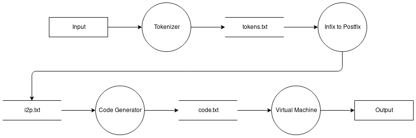

# cs3500project
Implementation of Infix to Postfix calculator for CS3500 C project

by Conor Patrick Mc Donald, Daniels Leonards Bindemans, and Jack Meade

# System Overview

## Tokenizer
The Tokenizer will read in the input file and parse the characters into tokens.

The expression in the input file can be have (no) spaces and be placed across multiple lines, so long as it would
be a valid infix if it were written on paper.

It will go through each character and hold the them in a buffer until an operator is reached, unless the operator
marks a negative number, in which case it is formatted to be part of the number. Then it will format the buffer and
place this on an output string.

When an operator is reached, it will format this and place it onto the output string straight away as they are a single
character, unless they are the marker for a negative number.

Output will be a file containing the formatted output.

## I2P
I2P will read in the file from the Tokenizer and use Shunting-yard algorithm to convert Infix to Postfix.

It will use two stacks: an output stack and an operator stack.

It'll go through each line and place numbers on the output stack. When an operator is reached, it'll use Shunting-yard
to determine how it should pop/push from the operator stack according to it's rules for precedence.

If a closing parenthesis is found, it will continually pop from the stack until the newest opening parenthesis is found.

Output will be a file containing the formatted output in Postfix order.

## Code Generator
The Code Generator will read in the file from I2P and start generating instructions for the VM to follow.

It will place these instructions onto a formatted output string.

It will look at the token type and value to determine what the instructions should be,
e.g. a number if the line begins with "n" or MUL if the line begins with "o" and value is “\*”.

Output will be a file where each instruction is on a newline.

## VM
The VM will start reading instructions from the start of the file passed in by the Code Generator.

It will load numbers into a stack, keeping track of the top of the stack with a pointer. It will start to perform
arithmetic operations on the stack when an operator is reached.

It will have rules associated with each operator, and pop from the stack to perform arithmetic on the operands accordingly.

The last value in memory will be the result, which will be outputted to the user as a string.

# Functional Requirements
1. Calculator should accept valid user input e.g. any real number (operator) any real number
1. Input file should not have illegal expressions, e.g. 1++ or 2/0
1. A full range of operations should be available e.g. + / ^ etc.
1. Component output is what is expected by the next component

1. Tokenizer can read input file
1. Tokenizer makes input file into tokens
1. Tokenizer is able to parse all necessary information for operands/operators from input file
1. Tokenizer is able to read input file with or without spaces
1. Tokenizer is can differentiate integers, floats, and operators in input file

1. I2P converts expression from Infix to Postfix

1. Code Generator generates instructions
1. Code Generator has formatted output structure

1. VM runs instructions and outputs result to user
1. VM only execute instructions
1. VM output is human-readable

# Interfaces Between The System Components
## Tokenizer -> I2P
Tokenizer will output a file, each line is a token consisting of its type ("n" or "o") and the type's value separated
by a comma. An example:

>n,-25
>
>o,-
>
>o,(
>
>n,7.25
>
>o,*
>
>n,3
>
>o,)

I2P will read this file, go through each line and process each token according to rules
associated with its type in accordance to Shunting-yard algorithm.

## I2P -> Code Generator
I2P will use Shunting-yard algorithm to structure the conversion from Infix to Postfix. This outputs a file,
each line is a token consisting of its type ("n" or "o") and the type's value separated by a comma. This file will
contain no parentheses. An example:

>n,-25
>
>n,7.25
>
>n,3
>
>o,*
>
>o,-

The Code Generator will go through the file and can read each line in it to generate code. It
will know to load numbers by reading the token’s type, and place the number on a newline in it's output file.
It can read operators by the token type/value and generate their appropriate arithmetic instruction.

## Code Generator -> VM
The Code Generator will output a file containing instructions on each line. Each line will either be
a number or an operator shortened to three characters (e.g. * will be MUL). An example:

>-25
>
>7.25
>
>3
>
>MUL
>
>SUB

Each line in the file will be an instruction on what the VM should do, such
as load a number or ADD two from the stack. The VM can read these and perform the instructions by having it follow
rules assigned to them.

# Data Flow Diagram

